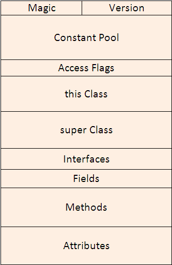

# Inside the JVM

This document explains the Java Virtual Machine (JVM), its architecture, memory model, and key concepts. It includes examples and small code snippets to help understand the inner workings of Java.

## 1. Java Program Lifecycle

Before running a Java program:

1. **Compile Java sources** into `.class` files (bytecode) using `javac`.
2. Bytecode is loaded by the JVM and executed.

```bash
javac MyProgram.java
java MyProgram
````

**Compilation flow:**

```
.java → .class → bytecode → JVM → native machine code
```

## 2. Java Class File Structure

A compiled Java `.class` file is a precisely formatted binary stream, not a simple text file. Its structure is defined by the JVM specification. Understanding this structure is key to understanding how the JVM loads and executes code.

- illustration of .class structure

  


| Component | Description |
| :--- | :--- |
| **Magic Number** | The first 4 bytes of every `.class` file are the magic number `0xCAFEBABE`. This uniquely identifies the file as a valid Java class file for the JVM. |
| **Version** | The next 4 bytes specify the **minor version** (2 bytes) and **major version** (2 bytes) of the compiler that produced the file. The JVM uses this to verify it can execute this class file (e.g., a class file with version 61 (Java 17) cannot run on a JVM that only supports version 52 (Java 8)). |
| **Constant Pool** | This is a **runtime constant pool**. It is a table of structures representing all string constants, class and interface names, field names, and other constants referred to within the ClassFile. |
| **Access Flags** | A mask of modifiers (as bits) applied to the class or interface. Flags include `ACC_PUBLIC`, `ACC_FINAL`, `ACC_SUPER`, `ACC_INTERFACE`, `ACC_ABSTRACT`, `ACC_SYNTHETIC`, `ACC_ANNOTATION`, and `ACC_ENUM`. |
| **This Class** | An index into the Constant Pool that must point to a `CONSTANT_Class_info` structure. This structure itself contains an index to a `CONSTANT_Utf8_info` structure which holds the name of the current class. |
| **Super Class** | An index into the Constant Pool for the `CONSTANT_Class_info` of the immediate superclass. For the `Object` class, this value is zero. For interfaces, it points to `java/lang/Object`. |
| **Interfaces** | An array of indices into the Constant Pool. Each index points to a `CONSTANT_Class_info` structure representing an interface that this class directly implements (or, if an interface, directly extends). |
| **Fields** | A table of structures each giving a complete description of a field in the class. This includes the field's name, descriptor (type), and access flags (e.g., `private`, `static`, `final`). |
| **Methods** | A table of structures each giving a complete description of a method in the class. Each method structure includes its name, descriptor (return type and parameters), access flags, and most importantly, the **Code attribute**. |
| **Attributes** | A table of attributes that carry additional information about the class. There are many predefined attributes (e.g., `SourceFile` contains the name of the source file), and compilers can define custom attributes. Crucially, the **bytecode** for methods is not stored directly in the **Methods** table but inside a special attribute of a method_info structure called the **Code attribute**. |

## 3. JVM vs JRE vs JDK

| Component | Description                                                        |
| --------- | ------------------------------------------------------------------ |
| JVM       | Executes Java bytecode on a platform. Manages memory, threads, GC. |
| JRE       | JVM + runtime libraries (enables execution of Java programs).      |
| JDK       | JRE + development tools (javac, jar, javadoc). |

## 4. Class Loading

To execute this bytecode the JVM must have this class and this is where the role of the class loader comes in to load classes into memory. The JVM doesn’t load all classes at once. It’s smarter than that. Classes are loaded only when needed. The process is handled by different types of ClassLoaders:

| Loader     | Responsibility                              |
| ---------- | ------------------------------------------- |
| Bootstrap  | Loads core Java classes (`java.*`)          |
| Platform   | Loads JDK extensions (`$JAVA_HOME/lib/ext`) |
| System/App | Loads classes from app classpath            |
| Custom     | User-defined dynamic loading                |

Class Loader Flow follow the delegation model

1. Request to load class
2. Parent class loader tries first
3. If not found, child loader attempts
4. Throws `ClassNotFoundException` if class not found

Example of inspecting class loader:

```java
public class ClassLoaderTest {
    public static void main(String[] args) {
        System.out.println(java.util.HashMap.class.getClassLoader()); // null → bootstrap
        System.out.println(sun.net.spi.nameservice.dns.DNSNameService.class.getClassLoader()); // ExtClassLoader
        System.out.println(ClassLoaderTest.class.getClassLoader()); // AppClassLoader
    }
}
```

## 5. JVM Execution Phases

### Loading

* Classes are loaded into **Metaspace**.
* Includes superclass and interfaces.

### Linking

1. **Verification**: Checks class file format.
2. **Preparation**: Allocates memory for static fields.
3. **Resolution**: Resolves symbolic references.

### Initialization

* Executes static initializers (`static { ... }`) and `static` fields.
* Triggered when:

  * An instance is created (`new`)
  * Accessing static field/method


## 6. Bytecode Execution

### Interpreter

* Executes bytecode instruction-by-instruction.
* Slow but simple.

### Compilers

- [compilers](./3-compilers.md)

## 7. Memory Management

- [jvm-memory-model](./jvm-memory-model.md)


## 8. Garbage Collection (GC)

- [garbage-collector](./garbage-collector.md)

## 9. Threads in JVM

* Java threads map to OS threads.
* Each thread has its own **stack**.
* Virtual threads (Project Loom) allow **millions of lightweight threads**.
* Use `volatile` for memory visibility.
* Synchronization needed for **shared memory** access.