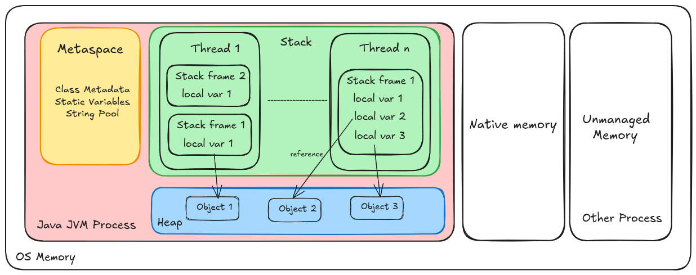

# JVM Memory Model
In this document we will explain how jvm manage the memory including: Heap, Stack, Metaspace, and the Java Memory Model

## Table of Contents
1.  [Runtime Data Areas: The Core Components](#runtime-data-areas-the-core-components)
2.  [The Heap: The Object Nursery](#the-heap-the-object-nursery)
3.  [The Stack: Thread Execution and Frames](#the-stack-thread-execution-and-frames)
4.  [Metaspace: The Home for Class Data](#metaspace-the-home-for-class-data)
5.  [Garbage Collection: Keeping the Heap Clean](#garbage-collection-keeping-the-heap-clean)
6.  [The Java Memory Model (JMM) for Concurrency](#the-java-memory-model-jmm-for-concurrency)

## Runtime Data Areas: The Core Components

When the Java Virtual Machine (JVM) runs a program, it divides the memory it uses into several different data areas. These areas have distinct purposes, lifetimes, and roles in the program's execution. The key areas are visualized in the following diagram:

Each thread has its own **Program Counter (PC) Register** and **JVM Stack**. The **Heap** and **Metaspace** are shared among all threads and contain the program's data and class information.

## 1. The Heap

The Heap is the runtime data area from which memory for all class instances and arrays is allocated. It is created on JVM startup and shared among all threads.

**Key Characteristics:**
*   **Shared & Dynamic:** One Heap per JVM. Its size can be fixed or dynamic.
*   **Garbage Collected (GC):** This is the main area managed by the Garbage Collector. The process of freeing memory by destroying unreachable objects is called GC.
*   **Tuned via Arguments:**
    *   `-Xms`: Initial heap size (e.g., `-Xms256m`)
    *   `-Xmx`: Maximum heap size (e.g., `-Xmx2g`)
    *   `-Xmn`: Size of the Young Generation (within the heap)
*   **OutOfMemoryError:** When the heap is full and cannot allocate new memory, Java throws an OutOfMemoryError.

## 2. The Stack

Each JVM thread has a private **JVM Stack** created at the same time as the thread. It stores **stack frames** (also called activation records).

*   **A stack frame** is created each time a method is invoked and destroyed when the method completes (whether normally or abruptly).
*   Each frame contains:
    *   **Local Variable Array (LVA):** Contains the method's parameters and local variables. All variables here are stored by value. For object types, the variable holds a *reference* (pointer) to the actual object in the Heap.
    *   **Operand Stack (OS):** A LIFO stack used for pushing and popping values during the execution of bytecode instructions. This is the JVM's workbench.
    *   **Dynamic Linking:** A reference to the runtime constant pool for the method's class, supporting dynamic binding.
    *   **Return Address:** The location to resume execution when the method returns.

* **StackOverflowError:** If the stack exceeds its allocated space (e.g., due to infinite recursion), a StackOverflowError occurs.
* **Performance:** Stack access is faster than heap access due to its simple structure, requiring no garbage collection.

## 3. Metaspace

**Metaspace** is a native memory area (outside the Heap) that replaced the Permanent Generation (PermGen) in Java 8.

It stores:
*   **Class metadata:** The internal representations of Java classes (e.g., bytecode, field & method metadata, method code, etc.).
*   **Class structures:** Information about loaded classes.
* **Static fields:** the static fields defined in the class
*   **The String Table (String Constant Pool):** This is where String literals (e.g., `String s = "hello";`) are stored.

Key Characteristics:
*   **Native Memory:** Resides outside the Java Heap, in the process's own memory space.
*   **Automatically Sized:** By default, Metaspace dynamically resizes itself to avoid `OutOfMemoryError: Metaspace`.
*   **Tuned via Arguments:**
    *   `-XX:MaxMetaspaceSize`: Sets the maximum limit for Metaspace.
    *   `-XX:MetaspaceSize`: The initial size threshold at which GC will start to collect class metadata.

## 4. Garbage Collection: Keeping the Heap Clean

Garbage Collection is the process of automatically freeing memory by destroying objects that are no **reachable**.
see
- [garbage-collector.md](./2-garbage-collector.md)

## 5. The Java Memory Model (JMM) for Concurrency

The Java Memory Model (JMM) is a **formal specification** that defines how threads interact through memory. It's not the same as the physical memory structure (Heap, Stack, etc.). The JMM's primary goal is to define the conditions under which a write by one thread becomes visible to another thread.